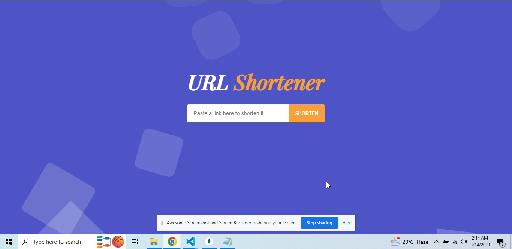
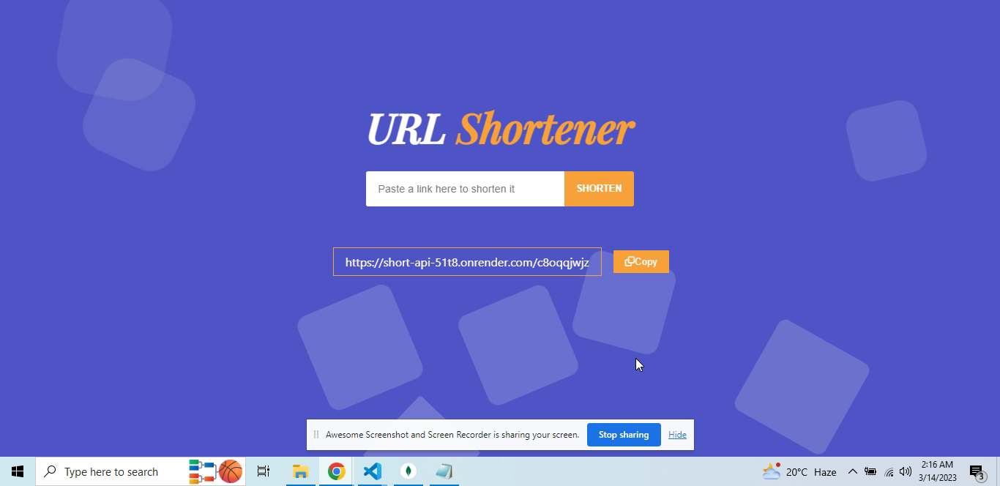

# Project - URLShortify Frontened

## Make sure to check Backend Repository :
https://github.com/insh007/URLShortify-Backend

## Deploy Link :
https://url-shortify-app.onrender.com

A simple MERN stack application for shortening long URLs, inspired by services like TinyURL and Bitly.

## Screenshots
The following screenshots provide a visual representation of the app:

###### Screenshot 1

<br>
<br>
<br>

###### Screenshot 2

<br>
<br>
<br>


## Table of Contents
1. Description
2. Demo
3. Features
4. Technologies
5. Installation
6. Usage 
7. Contributing

## Description
This application provides a user-friendly interface for shortening long URLs into shorter ones. The user can enter a long URL, and the application will generate a shorter URL that can be used in place of the original.

## Demo
A live demo of the application can be found at https://url-shortify-app.onrender.com.

## Features
The following features are currently implemented:

1. Shorten long URLs
2. Copy the shortened URL to the clipboard
3. Redirect users to the original URL when they use the shortened URL
 
## Technologies
This application uses the following technologies:

1. MongoDB
2. Express
3. React
4. Node.js
5. HTML
6. CSS

## Installation
To run the application locally, follow these steps:

1. Clone the repository

```
git clone https://github.com/insh007/URL-Shortify-Frontend
```

2. Install dependencies
```
npm install
```

3. Start the server
```
cd shortify & npm start 
```

## Usage
To shorten a URL, simply enter it into the input field on the home page and click "Shorten". The application will generate a shorter URL that can be used in place of the original.

## Contributing
Contributions are always welcome! If you have any ideas or suggestions for improvement, feel free to open an issue or submit a pull request.